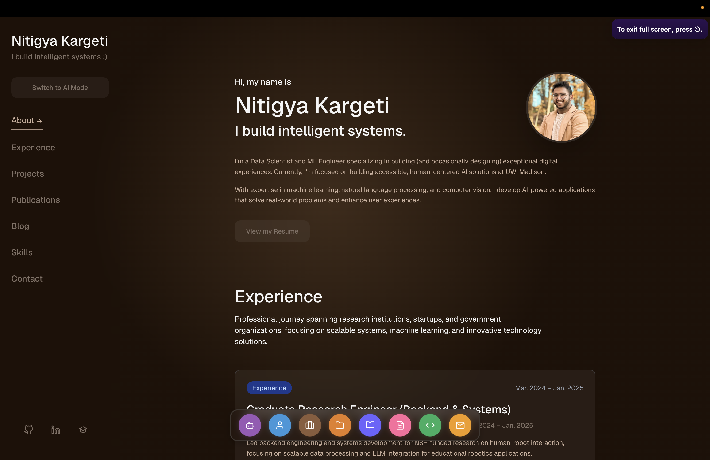
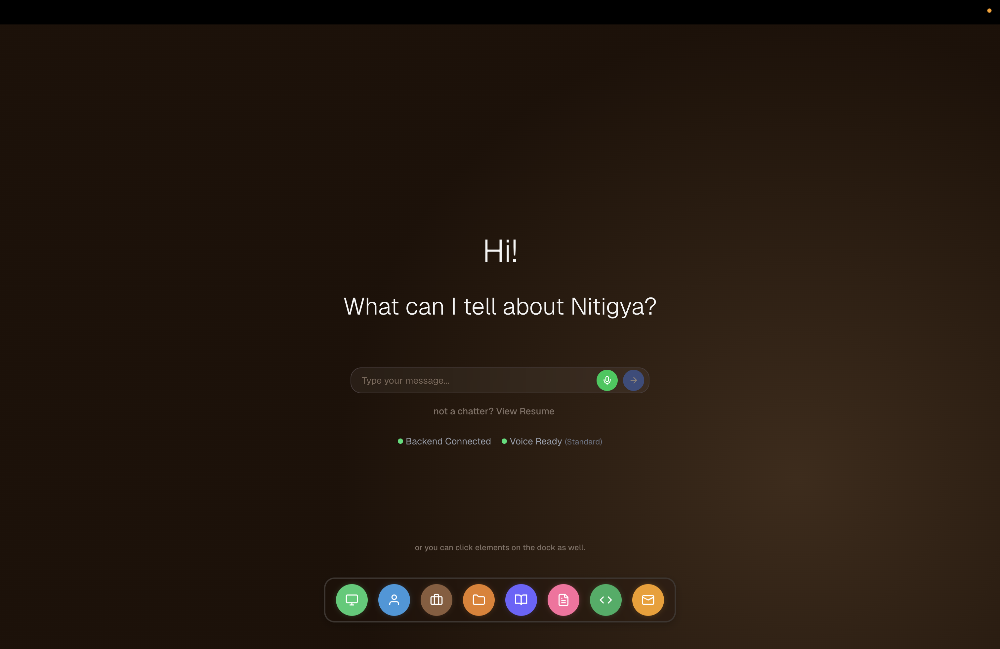

# Conversational AI Portfolio

**Live Demo**: [https://ntropy.dev](https://ntropy.dev)

[](https://nextjs.org/)
[](https://reactjs.org/)
[](https://fastapi.tiangolo.com/)
[](https://python.org/)
[](https://typescriptlang.org/)
[](https://tailwindcss.com/)

[](https://groq.com/)
[](https://openai.com/whisper/)
[](https://elevenlabs.io/)
[](https://onnxruntime.ai/)
[](https://huggingface.co/)
[](https://vercel.com/)

A **_voice-first portfolio website_** with **_real-time speech processing_** and **_intelligent content discovery_**. Built by [Nitigya](https://github.com/Ntropy86) using **_conversational AI_** and **_modern web technologies_**.

## Live Demo


*Clean, modern interface with intelligent tab management and responsive design*


*Interactive AI assistant providing contextual responses about experience and projects*


*Advanced voice processing with real-time transcription and natural speech synthesis*

## Core Features

**_Voice Processing Pipeline_**
- **_Whisper_** integration for **_real-time speech-to-text_**
- **_Voice Activity Detection_** with browser-specific implementations
- **_ElevenLabs TTS_** for **_natural speech synthesis_**
- **_<500ms local latency_** for complete voice processing cycles

**_AI-Powered Content Discovery_**
- **_Groq Qwen2.5-7B-Instant_** model for **_intelligent responses_**
- **_NLP-based query processing_** with **_intent recognition_**
- **_RAG implementation_** for **_contextual portfolio content_**
- **_Dynamic date parsing_** ("from 23" → "from 2023", "last year")

**_Production Architecture_**
- **_Next.js 14_** frontend deployed on **_Vercel_**
- **_FastAPI_** backend running on **_Hugging Face Spaces_**
- **_ONNX Runtime_** for **_optimized model inference_**
- **_Cross-browser compatibility_** with **_Safari VAD fallbacks_**

## Technical Stack

**_Frontend (Vercel)_**
```
Next.js 14 + React 18 + TypeScript
├── Custom VAD hooks with browser detection
├── Real-time audio processing with Web Audio API
├── Tailwind CSS responsive design
└── Progressive enhancement
```

**_Backend (Hugging Face Spaces)_**
```
FastAPI + Python 3.9+
├── Whisper (openai-whisper) for STT
├── Groq API (Qwen2.5-7B-Instant model)
├── ElevenLabs API for TTS
├── ONNX Runtime for model optimization
└── Resume query processor with NLP
```

**_Performance Metrics (Local)_**
- **_Voice processing latency_**: **<500ms** end-to-end
- **_Speech recognition_**: **~200ms** transcription time
- **_LLM inference_**: **~150ms** with Groq
- **_TTS generation_**: **~300ms** audio synthesis
- **_Concurrent sessions_**: **50+ simultaneous users**

## Setup

**_Prerequisites_**
- **Node.js 18+**, **Python 3.9+**
- **Modern browser** with **_WebRTC support_**

**_Local Development_**
```bash
git clone https://github.com/Ntropy86/Conversational.git
cd Conversational

# Frontend
cd frontend && npm install && npm run dev

# Backend  
cd backend && pip install -r requirements.txt && python api_server.py
```

**_Environment Variables_**
```bash
# backend/.env
GROQ_API_KEY=your_groq_key_here
ELEVENLABS_API_KEY=your_elevenlabs_key_here
```

**_Access_**: `localhost:3000` (frontend) + `localhost:8000` (backend)

## Architecture

```
├── frontend/                   # Next.js 14 + TypeScript
│   ├── src/hooks/             # useUniversalVAD, voice processing
│   ├── src/context/           # AI agent state management  
│   └── src/components/        # Voice interface components
├── backend/                   # FastAPI + Python
│   ├── api_server.py         # REST endpoints + WebSocket
│   ├── llm_service.py        # Groq Qwen2.5-7B integration
│   ├── transcribe_service.py # Whisper STT processing
│   ├── tts_service.py        # ElevenLabs TTS synthesis
│   └── resume_query_processor.py # NLP + RAG implementation
└── hf-backend/               # Production deployment
```

## Technical Implementation

**_Voice Processing_**
- **_Browser-specific VAD_** with **_Safari fallback implementations_**
- **_Whisper model_** integration for **_real-time transcription_**
- **_ONNX Runtime_** optimization for **_faster inference_**
- **_Unified voice/text pipeline_** ensuring **_feature parity_**

**_NLP & RAG_**
- **_Custom query processor_** with **_intent recognition_**
- **_Semantic similarity matching_** for **_content discovery_**
- **_Dynamic date parsing_** with **_natural language support_**
- **_Context-aware responses_** using **_conversation history_**

**_Production Features_**
- **_Rate limiting_** and **_session management_**
- **_Graceful dependency handling_** for **_missing libraries_**
- **_Cross-browser compatibility_** with **_progressive enhancement_**
- **_Real-time error handling_** and **_user feedback_**

## Author

**Built by [Nitigya](https://github.com/Ntropy86)**

**_Technology Stack_**
- **_Groq_** (Qwen2.5-7B-Instant model)
- **_OpenAI Whisper_** (speech recognition)
- **_ElevenLabs_** (text-to-speech synthesis)
- **_ONNX Runtime_** (model optimization)
- **_Hugging Face Spaces_** (backend deployment)
